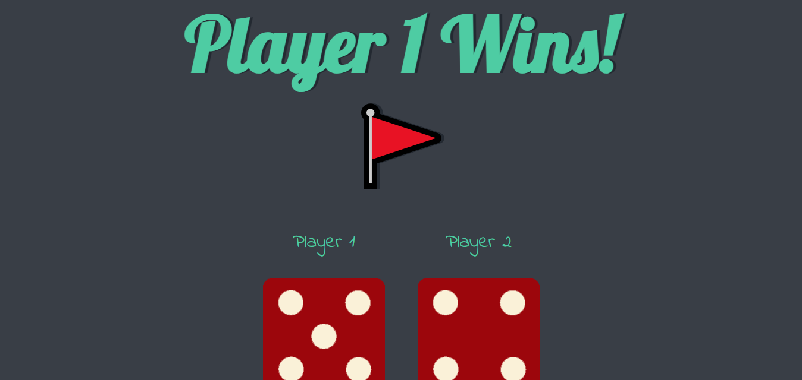

## Dicee-Game 

## Using Javascript to randomly gave dicee images and predict the Winner!

<h2 align="center">
  <a href="https://dicee-game-faseeh.vercel.app/" target="_blank">dicee-game-faseeh.vercel.app</a>
</h2>

<div align="center">
  
</div>

<br/>


## Built With

This project was built using these technologies.

- Dicee-images
- Css
- Javascript
- VsCode
- Html

## Features

**📃 Markdown Support**

**✏️ Easy to customize and write of your own**

**🎨 Styled with simple Css & Dicee-images**

## Getting Started

### 🛠 Installation and Setup Instructions

To get started just clone this repository. You will need to download live server on your machine.

Run

```
run on live server
```
Open with port: 5500 your browser to see the result.

## Usage Instructions

To write your own create a new index.html and modify according to your own on requirements.

### Show your support

Give a ⭐ if you like this website!

<a href="https://www.buymeacoffee.com/faseeh41" target="_blank"></a>
